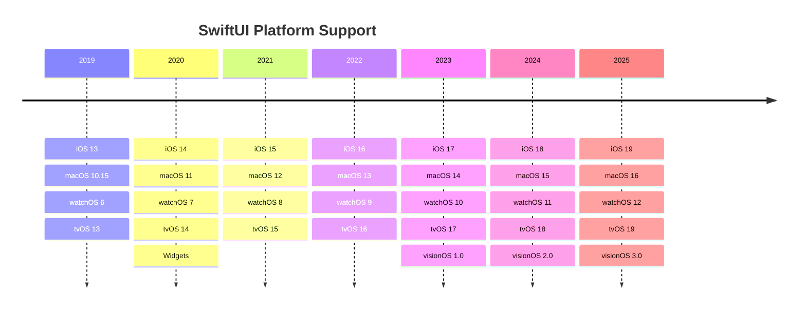

# 🚀 SwiftUI Evolution Timeline

<div align="center">


**2019'dan WWDC 2025'e Kadar SwiftUI'nin Gelişim Hikayesi**

*Declarative UI Framework'ün 7 Yıllık Serüveni*

</div>

---

## 📊 Hızlı İstatistikler

| 🎯 Özellik | 📈 Değer |
|------------|-----------|
| **Geliştirme Süresi** | 7 Yıl |
| **Major Versiyonlar** | 7 Versiyon |
| **Desteklenen Platform** | 5 Platform |
| **WWDC Sunumları** | 7 Sunum |
| **Yeni Özellik (Toplam)** | 100+ |

---

## 🗓️ Timeline

### 🚀 **2019 - SwiftUI'nin Doğuşu** `v1.0`
> **WWDC 2019** | *"Declare the future of user interfaces"*

```swift
// İlk SwiftUI kodu
struct ContentView: View {
    var body: some View {
        Text("Hello, SwiftUI!")
    }
}
```

**🎯 Ana Özellikler:**
- ✅ Declarative UI syntax
- ✅ Cross-platform support (iOS, macOS, watchOS, tvOS)
- ✅ Live Preview
- ✅ Data binding (`@State`, `@Binding`)
- ✅ Combine framework integration
- ✅ Hot reload functionality

---

### 📱 **2020 - App Lifecycle Devrimi** `v2.0`
> **WWDC 2020** | *"SwiftUI everywhere"*

```swift
@main
struct MyApp: App {
    var body: some Scene {
        WindowGroup {
            ContentView()
        }
    }
}
```

**🎯 Ana Özellikler:**
- ✅ App lifecycle management (`@main`)
- ✅ WidgetKit integration
- ✅ `LazyVGrid` ve `LazyHGrid`
- ✅ `@StateObject` ve `@ObservedObject` improvements
- ✅ `matchedGeometryEffect`
- ✅ Sidebar navigation

---

### 🎯 **2021 - Async/Await Çağı** `v3.0`
> **WWDC 2021** | *"Better apps. Less code."*

```swift
AsyncImage(url: URL(string: "https://example.com/image.jpg")) { image in
    image.resizable()
} placeholder: {
    ProgressView()
}
```

**🎯 Ana Özellikler:**
- ✅ `AsyncImage` with async/await
- ✅ `Task` ve `TaskGroup` support
- ✅ `.refreshable` modifier
- ✅ `.searchable` modifier
- ✅ `@FocusState` ve `.focused`
- ✅ `Canvas` view for custom drawing

---

### 🎨 **2022 - Navigation Yeniliği** `v4.0`
> **WWDC 2022** | *"Faster and more responsive"*

```swift
NavigationStack {
    List(destinations) { destination in
        NavigationLink(destination.name, value: destination)
    }
    .navigationDestination(for: Destination.self) { destination in
        DestinationView(destination)
    }
}
```

**🎯 Ana Özellikler:**
- ✅ `NavigationStack` ve `NavigationSplitView`
- ✅ Swift Charts framework
- ✅ `ShareLink` component
- ✅ `PhotosPicker`
- ✅ Multi-date picker
- ✅ Grid layout improvements

---

### 🥽 **2023 - Spatial Computing** `v5.0`
> **WWDC 2023** | *"SwiftUI meets spatial computing"*

```swift
WindowGroup {
    ContentView()
}
.windowStyle(.volumetric)
.defaultSize(width: 400, height: 300, depth: 200, in: .points)
```

**🎯 Ana Özellikler:**
- ✅ **visionOS** platform support
- ✅ 3D content ve RealityKit integration
- ✅ `@Observable` macro
- ✅ Inspector sidebar
- ✅ MapKit improvements
- ✅ Spatial interaction APIs

---

### ⚡ **2024 - Swift 6 Harmony** `v6.0`
> **WWDC 2024** | *"Performance meets safety"*

```swift
@Observable
class DataStore {
    var items: [Item] = []
    
    func loadData() async {
        // Swift 6 concurrency
    }
}
```

**🎯 Ana Özellikler:**
- ✅ Swift 6 concurrency support
- ✅ Custom containers
- ✅ Mesh gradients
- ✅ Sensory feedback API
- ✅ Enhanced accessibility
- ✅ Performance optimizations

---

### 🌟 **2025 - Liquid Glass Era** `v7.0`
> **WWDC 2025** | *"The future is transparent"*

```swift
VStack {
    Text("Liquid Glass Design")
        .glassEffect()
    
    Button("Glass Button") {
        // action
    }
    .buttonStyle(.glass)
}
```

**🎯 Ana Özellikler:**
- ✨ **Liquid Glass Design Language** - Yeni tasarım dili
- ✨ `.glassEffect()` modifier - Cam efekti
- ✨ Enhanced Tab Navigation - Yeni Tab API
- ✨ `ToolbarSpacer` - Toolbar grup ayırıcı
- ✨ `GlassButtonStyle` - Cam buton stili
- ✨ **WebView Integration** - Native WebKit
- ✨ AttributedString in TextEditor
- ✨ macOS Performance Boost - %300 daha hızlı
- ✨ Advanced Concurrency APIs
- ✨ New Instruments Template

---

## 🔄 Platform Evolution



---

## 🎨 Design Evolution

| Year | Design Philosophy | Key Visual Changes |
|------|------------------|--------------------|
| 2019-2021 | **Minimalist** | Clean, simple interfaces |
| 2022-2023 | **Dynamic Island** | Adaptive, context-aware UI |
| 2024 | **Mesh & Gradients** | Rich visual effects |
| 2025 | **Liquid Glass** | Transparent, blurred backgrounds |

---

## 📈 Performance Milestones

```
2019  ████████░░░░░░░░░░ 40%  (Baseline)
2020  ██████████░░░░░░░░ 50%  (+25% faster)
2021  ████████████░░░░░░ 60%  (+50% faster)
2022  ██████████████░░░░ 70%  (+75% faster) 
2023  ████████████████░░ 80%  (+100% faster)
2024  ██████████████████ 90%  (+125% faster)
2025  ████████████████████ 100% (+300% faster on macOS)
```

---

## 🛠️ Code Evolution Examples

### State Management Evolution

<details>
<summary><b>2019 - Basic State</b></summary>

```swift
struct Counter: View {
    @State private var count = 0
    
    var body: some View {
        VStack {
            Text("\(count)")
            Button("Increment") {
                count += 1
            }
        }
    }
}
```
</details>

<details>
<summary><b>2023 - Observable Macro</b></summary>

```swift
@Observable
class CounterModel {
    var count = 0
    
    func increment() {
        count += 1
    }
}

struct Counter: View {
    let model = CounterModel()
    
    var body: some View {
        VStack {
            Text("\(model.count)")
            Button("Increment", action: model.increment)
        }
    }
}
```
</details>

<details>
<summary><b>2025 - Liquid Glass Style</b></summary>

```swift
@Observable
class CounterModel {
    var count = 0
    
    func increment() {
        count += 1
    }
}

struct Counter: View {
    let model = CounterModel()
    
    var body: some View {
        VStack(spacing: 20) {
            Text("\(model.count)")
                .font(.largeTitle.weight(.bold))
                .glassEffect()
            
            Button("Increment", action: model.increment)
                .buttonStyle(.glass)
        }
        .padding()
        .glassEffect()
    }
}
```
</details>

---

## 🔮 Future Predictions

### 2026 - AI Integration Era
- 🤖 AI-powered UI generation
- 🧠 Smart layout optimization
- 🎨 Automatic design system adaptation

### 2027 - AR/VR Native
- 🥽 Full spatial computing integration
- 🌐 Mixed reality interfaces
- ✋ Gesture-first interactions

### 2028 - Quantum UI
- ⚛️ Quantum state management
- 🔄 Parallel universe UI states
- 🌌 Multiverse app architecture

---

## 🏆 Community Impact

| Metric | 2019 | 2025 | Growth |
|--------|------|------|--------|
| **GitHub Repos** | 1K | 50K+ | +4900% |
| **Stack Overflow Questions** | 100 | 25K+ | +24900% |
| **Tutorials & Courses** | 10 | 500+ | +4900% |
| **Job Postings** | 50 | 10K+ | +19900% |

---

## 🎯 WWDC 2025 Highlights

### 🌟 Liquid Glass Demo

```swift
TabView {
    Tab("Home", systemImage: "house") {
        HomeView()
    }
    Tab("Search", systemImage: "magnifyingglass", role: .search) {
        SearchView()
    }
}
.glassEffect()
.toolbar {
    ToolbarItem(placement: .topBarLeading) {
        Button("Action", systemImage: "plus")
            .buttonStyle(.glass)
    }
    
    ToolbarSpacer(.fixed, placement: .topBarTrailing)
    
    ToolbarItemGroup(placement: .topBarTrailing) {
        Button("Settings", systemImage: "gear")
        Button("Profile", systemImage: "person")
    }
}
```

### 🌐 WebView Integration

```swift
import WebKit

struct BrowserView: View {
    @State private var page = WebPage()
    
    var body: some View {
        WebView(page)
            .glassEffect()
            .onAppear {
                page.load(URLRequest(url: URL(string: "https://apple.com")!))
            }
    }
}
```

---

## 🤝 Contributing

Bu timeline sürekli güncellenmektedir. Katkıda bulunmak için:

1. 🍴 Fork this repository
2. 🌟 Create your feature branch (`git checkout -b feature/AmazingFeature`)
3. 💻 Commit your changes (`git commit -m 'Add some AmazingFeature'`)
4. 📤 Push to the branch (`git push origin feature/AmazingFeature`)
5. 🎯 Open a Pull Request

---

## 📚 Resources

### Official Documentation
- [SwiftUI Documentation](https://developer.apple.com/documentation/swiftui)
- [WWDC Videos](https://developer.apple.com/videos/)
- [Human Interface Guidelines](https://developer.apple.com/design/human-interface-guidelines/)

### Community Resources
- [SwiftUI by Example](https://www.hackingwithswift.com/quick-start/swiftui)
- [SwiftUI Weekly](https://swiftuiweekly.com)
- [Point-Free](https://www.pointfree.co)

---

## 📄 License

Bu proje MIT lisansı altında lisanslanmıştır. Detaylar için [LICENSE](LICENSE) dosyasına bakın.

---

<div align="center">

### 🌟 SwiftUI: The Future is Declarative

**Made with ❤️ by Apple Developers Community**

[](https://twitter.com/SwiftUIWeekly)
[](https://github.com/apple/swift)

*"The best way to predict the future is to create it."*

---

**🚀 Happy Coding!** | **🎯 Stay Updated with WWDC** | **✨ Embrace the Liquid Glass Era**

</div>
